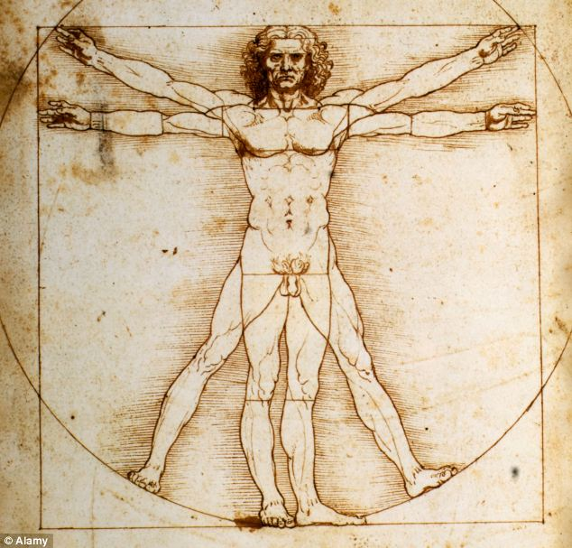

# perfect-human
Genotyping, genetic variations, SNP 
We will work with raw 23andMe data 
## The goals are:
- To establish probable ethnicity and (optionally) maternal (mtDNA) and paternal (Y-chromosome) haplogroups  
- To make annotation  
- To make fixes - specific changes to fix some issues (minimum 5)  
- To make improvements - specific changes to give the person in question some advantages (minimum 5) 

