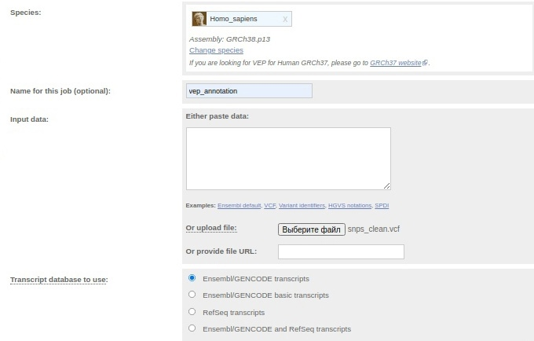
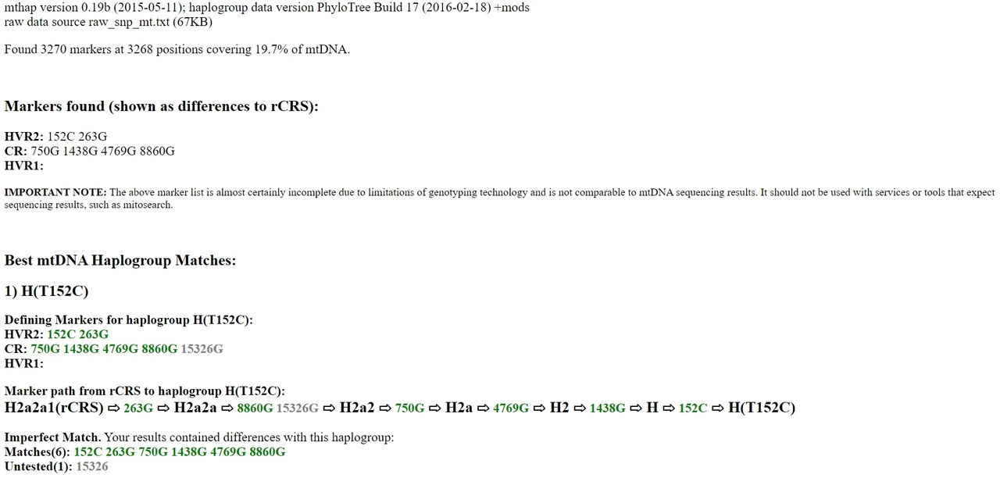
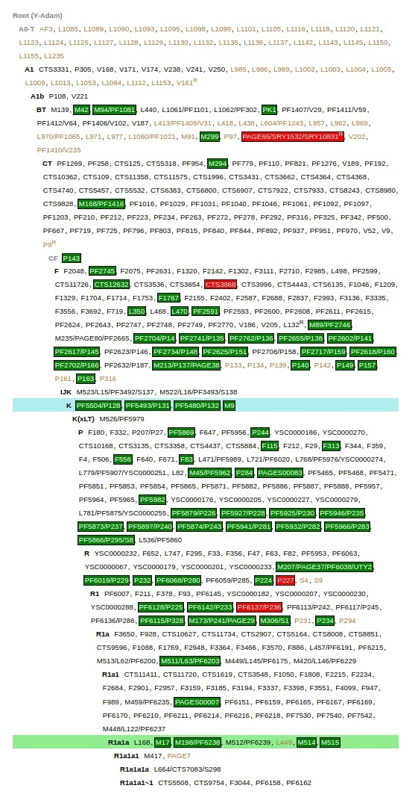
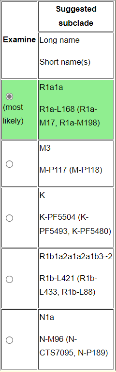

# Perfect human project
## 1. Converting the raw 23andMe data to vcf
I use plink - tool widely used in population genetics https://www.cog-genomics.org/plink/ <br>
I remove all SNPs corresponding to deletions and insertions, to make the file compatible with annotation tools<br>
The command is:<br>
```bash
~/Libs/plink_1_09/plink --23file <23_and_me_input.txt> --recode vcf --out snps_clean --output-chr MT --snps-only just-acgt
```
In my case:
```bash
home/kate_the_snail/Загрузки/plink_linux_x86_64_20210606/plink --23file ./data/SNP_raw_v4_Full_20170514175358.txt --recode vcf --out snps_clean --output-chr MT --snps-only just-acgt
```
## 2. Annotation
### 2.1. Running VEP
I chosed to use VEP (Variant Effect Predictor) online https://www.ensembl.org/Tools/VEP <br>
I used the following settings:<br>
<br>
I saved the results as vep_annotation.txt<br>
### 2.2. Chosing risk factors 
Then I chosed the SNPs which are risk factors using the command:<br>
```bash
awk '($32!="-") ' vep_annotation.txt | grep 'risk_factor' | cut -f 1-3 | sort | uniq > risk_factors.txt
```
There are 34 risk factors in the file risk_factors.txt<br>
### 2.3. Searching the SNPs in database
I used dbSNP https://www.ncbi.nlm.nih.gov/snp/ <br>
There will most likely be only rsIDs, because IDs that start with “i” are from the internal 23andMe database. However, this is more than enough<br>
The results:
```bash
1) i3000469 (T) - no results
2) i6007787 (G) - no results
3) i6058143 (G) - no results
4) i6059141 (G) - no results
5) rs1024611 (A>G) - CCL2 gene - Spina bifida, susceptibility to; Coronary artery disease, modifier of; Mycobacterium tuberculosis, susceptibility to;
6) rs1049296 (C>T) - TF gene - Alzheimer disease, susceptibility to;
7) rs1169288 (C>A) - HNF1A gene - Insulin resistance, susceptibility to; hdl cholesterol level, modifier of;
8) rs12150220 (A>T) - NLRP1 gene - Vitiligo-associated multiple autoimmune disease susceptibility 1;
9) rs13266634 (C>T) - SLC30A8 gene - Diabetes mellitus type 2, susceptibility to;
10) rs1801197 (A>G) - CALCR gene - Bone mineral density quantitative trait locus 15;
11) rs1801274 (A>G) - FCGR2A gene - Lupus nephritis, susceptibility to; Pseudomonas aeruginosa, susceptibility to chronic infection by, in cystic fibrosis; Malaria, severe, susceptibility to;
12) rs1801275 (A>G) - IL4R gene - Malaria, severe, susceptibility to; Lupus nephritis, susceptibility to; Pseudomonas aeruginosa, susceptibility to chronic infection by, in cystic fibrosis;
13) rs1801394 (A>G) - MTRR gene - Neural tube defects, folate-sensitive, susceptibility to; Down syndrome, susceptibility to;
14) rs1801968 (C>G) - TOR1A gene - Dystonia 1, torsion, modifier of;
15) rs2004640 (T) - IRF5 gene -  Systemic lupus erythematosus 10;
16) rs2073658 (C>T) - USF1 gene - Hyperlipidemia, familial combined, susceptibility to;
17) rs2184026 (C>T) - GABBR2 gene - Allele C - Tobacco addiction, susceptibility to;
18) rs2239704 (A>C) - LTA gene - Allele A - Leprosy, early-onset, susceptibility to;
19) rs2241880 (A>G) - ATG16L1 gene - Inflammatory bowel disease 10, susceptibility to;
20) rs2281845 (C>T) - CACNA1S gene - Thyrotoxic periodic paralysis, susceptibility to, 1;
21) rs231775 (A>G) - CTLA4 gene - Hashimoto thyroiditis, susceptibility to; Thyroid-associated orbitopathy, susceptibility to; Systemic lupus erythematosus, susceptibility to; Celiac disease 3; type 1 diabetes mellitus 12;
22) rs4402960 (G>T) - IGF2BP2 gene - Diabetes mellitus type 2, susceptibility to;
23) rs4880 (A>G) - SOD2 gene -  Microvascular complications of diabetes 6;
24) rs4961 (G>T) - SOD2 gene - Microvascular complications of diabetes 6;
25) rs5174 (C>T) - LRP8 gene - Myocardial infarction 1;
26) rs5186 (A>C) - AGTR1 gene - Hypertension, essential, susceptibility to;
27) rs61747071 (C>T) - RPGRIP1L gene - Retinitis pigmentosa in ciliopathies, modifier of;
28) rs6265 (C>T) - BDNF gene - Memory impairment, susceptibility to;
29) rs6280 (C>T) - DRD3 gene - Schizophrenia, susceptibility to; Essential tremor, susceptibility to;
30) rs6504649 (C>G) - XYLT2 gene - Pseudoxanthoma elasticum, modifier of severity of;
31) rs699 (A>G) - AGT gene - Hypertension, essential, susceptibility to; Preeclampsia, susceptibility to; Susceptibility to progression to renal failure in IgA nephropathy;
32) rs763110 (C>T) - FASLG gene - lung cancer, susceptibility to;
33) rs7794745 (A>T) - CNTNAP2 gene - Autism 15;
34) rs909253 (A>G) - LTA gene - Myocardial infarction; Psoriatic arthritis, susceptibility to.
```
## 3. mtDNA haplogroup
Creating a file which contains SNPs in mtDNA:<br>
```bash
awk '($32!="-") ' ./data/SNP_raw_v4_Full_20170514175358.txt | grep -P '\tMT\t' | sort | uniq > raw_snp_mt.txt
```
I am using mthap https://dna.jameslick.com/mthap/ <br>
The output:<br>
<br>
## 4. Y-chromosome haplogroup
Creating a file which contains SNPs in Y-chromosome:<br>
```bash
awk '($32!="-") ' ./data/SNP_raw_v4_Full_20170514175358.txt | grep -P '\tY\t' | sort | uniq > raw_snp_y.txt
```
I use Y-SNP Subclade Predictor https://ytree.morleydna.com/extractFromAutosomal <br>
The output:<br>
<br>
The suggested subclade:<br>
<br>

